# Ficha Seed-Labs

## Set-Up

Tal como guião nos indica, corremos os containers dados e obtemos uma shell no container MySQL (10.9.0.5), como pedido.

## Tarefa 1

O objetivo desta tarefa é injetar o código ```<script>alert(’XSS’);</script>``` num perfil.
O comando **alert()** em javascript cria uma janela pop-up com mensagem dada no parametro, no nosso caso, 'XSS'.<br>
Para que este código corra sempre que alguém visita um perfil em específico, temos de introduzi-lo em algum dos parametros do mesmo.<br>
Para isso, entramos no perfil da Alice com as credenciais disponibilizadas no guião e editámos o campo **brief description** para a linha de código referida anteriormente.

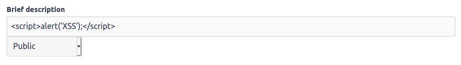

Assim, sempre que alguém visita o perfil da Alice a seguinte janela irá aparecer.

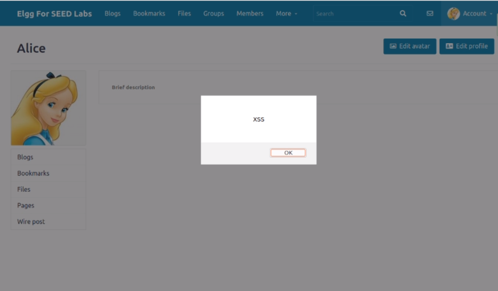

## Tarefa 2

O objetivo desta tarefa é também injetar código javascript num perfil mas, desta vez, pretendemos que apresente as cookies do utilizador na janela.
Para isso, editámos novamente a **brief description** do perfil da Alice para o código ```<script>alert(document.cookie);</script>```. Desta vez, alterámos também a restrição de visualização de **Public** para **Logged in users** já que, não estando autenticados, não existe nenhuma informação importante a mostrar.

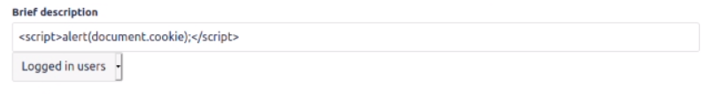

Deste modo, sempre que alguém visita o perfil da Alice a seguinte janela irá aparecer com as cookies do utilizador.

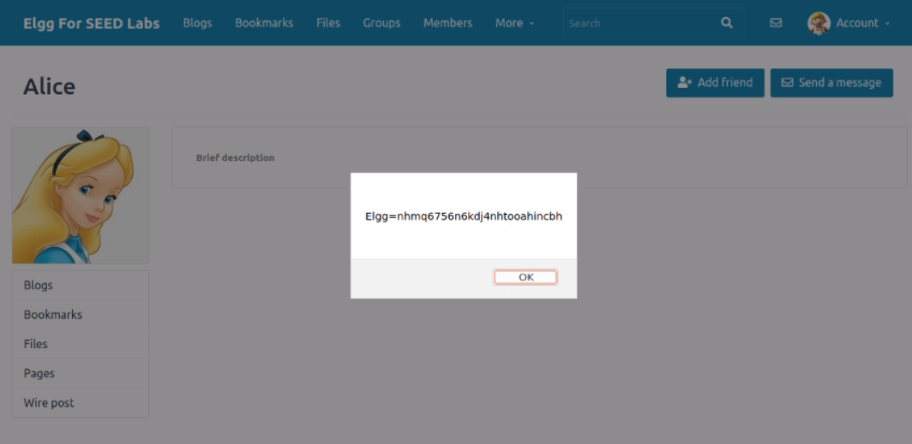

## Tarefa 3

O objetivo da tarefa é enviar as cookies do utilizador para o atacante.
Tal como indicado no enunciado, para conseguir enviar a informação para o atacante, foi inserida uma tag HTML (**\**) que realiza um request enviado para a máquina do atacante (porta 5555), através do campo **src**. Este código, tal como nas tarefas anteriores, foi introduzido no campo **brief description** do perfil da Alice.

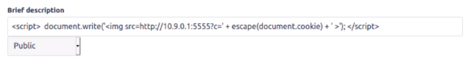

Ao utilizar o comando **nc -lknv 5555** conseguimos ter acesso à informação enviada pelo cliente.<br>
Na imagem abaixo verificamos que, quando o Boby visita o perfil da Alice, conseguimos ter acesso às suas cookies.

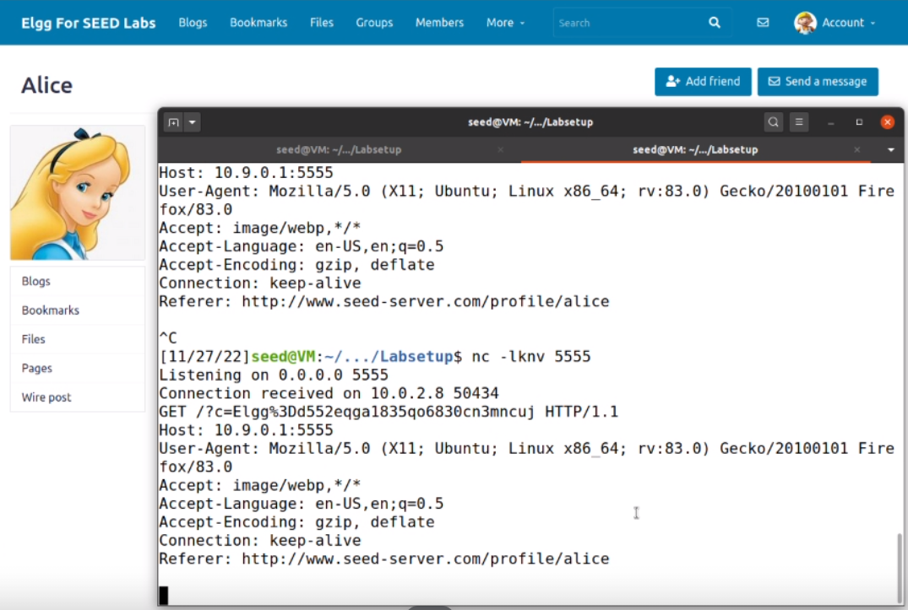

## Tarefa 4

O objetivo desta tarefa é injetar código no perfil do Samy de tal forma que, quando um user visita o perfil, se torna amigo do Samy.<br>
Primeiro, inspecionamos o perfil de forma a recolher o url associado à ação de adicionar o utilizador Samy como amigo.

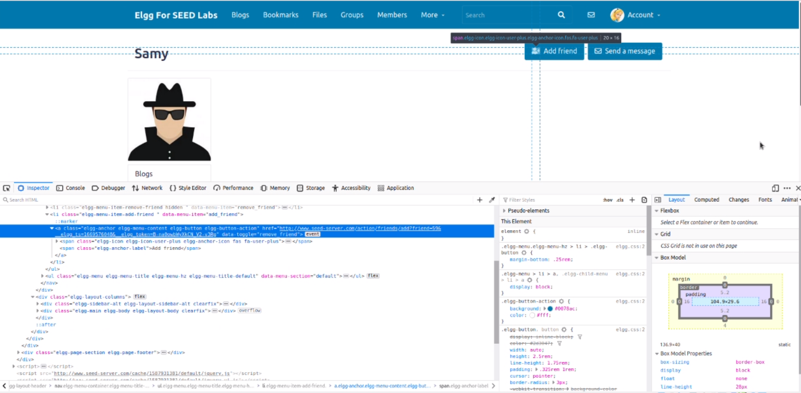

De seguida, editamos o campo **about me** do perfil do Samy para o script fornecido no guião com o link obtido acima. Foi utilizado este campo e não a brief description devido ao facto do tamanho do script ser maior do que os anteriores.

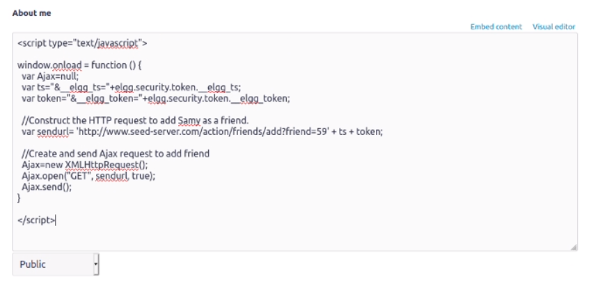

Finalmente, é possível observar que, estando logged in no perfil da Alice, ao visitar o perfil do Samy, a Alice passa a ser amiga do Samy mesmo não tendo feito pedido de amizade.

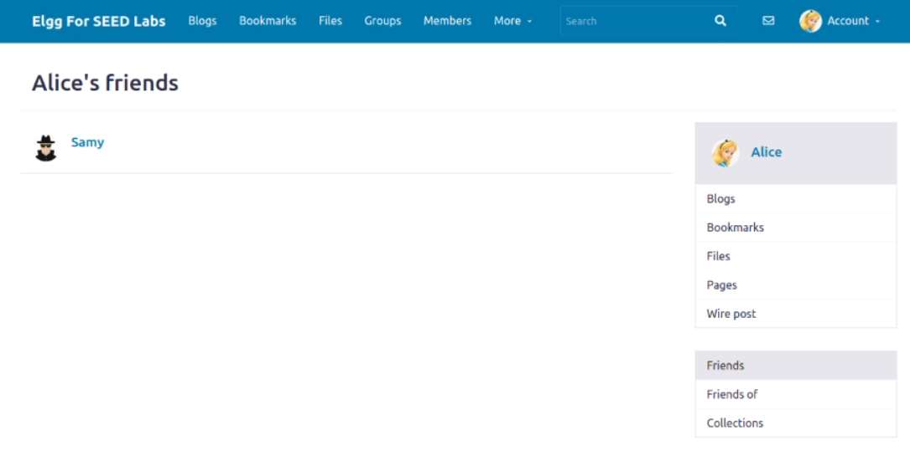

Questões finais:

#### **Explain the purpose of Lines ➀ and ➁, why are they needed?**
- A linha ➀ contém informação sobre o timestamp e a linha ➁ sobre o elgg token. Estes são utilizados como validação do pedido HTTP para que o server considere que a origem deste é a vítima.

#### **If the Elgg application only provide the Editor mode for the "About Me" field, i.e., you cannot switch to the Text mode, can you still launch a successful attack?**
- O modo de texto converte carateres especiais em texto, incluindo os carateres **<** e **>**, utilizados para demarcar código html.

----

# CTF

## Desafio 1

Assim que abrimos o site verificamos que não existe qualquer sanitização de input ao escrever a justificação.

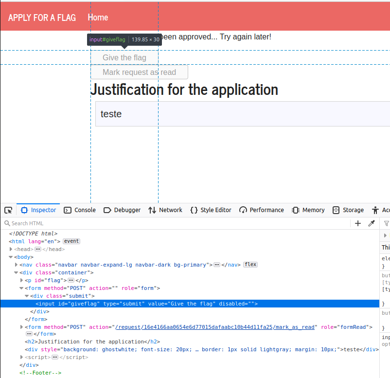

A partir da imagem acima, temos também acesso à configuração do botão que nos dá a flag.
Deste modo, iremos injetar um script de javascript que recolhe esse elemento e através da função **click()** obrigará o admin a clicar nesse botão e assim aprovar o nosso pedido.

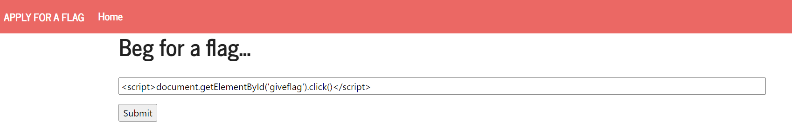

Chegamos então à flag! 

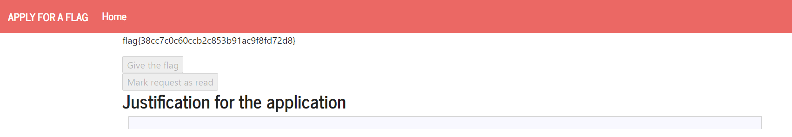

## Desafio 2

A página inicial deste desafio mostra-nos um formulário de login e um link para uma página que nos permite dar ping a um host qualquer ou ver a velocidade da nossa rede.
Ao explorar a página que dá ping e com a ajuda do enunciado no CTF no moodle, verificamos que está a ser utilizado um utilitário linux.

A partir daí também verificamos que podemos inserir vários comandos linux num só pedido de ping separando-os com "**;**".


Deste modo, através do comando **cat**, chegamos à flag pretendida.


