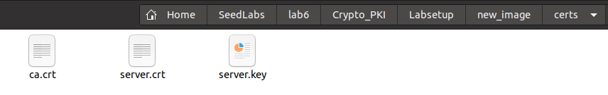
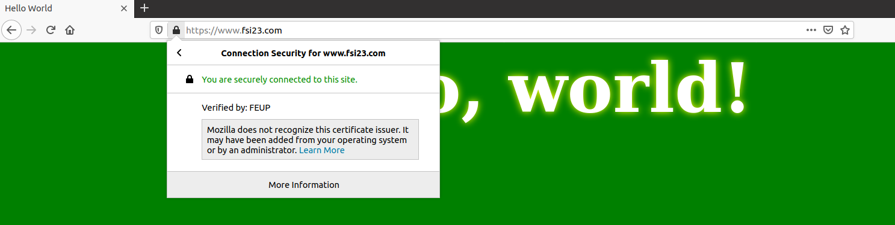
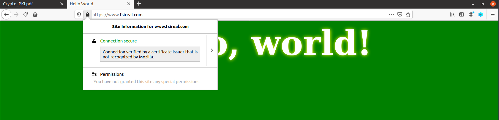

# LOGBOOK11

# Ficha SeedLabs

-----

## Tarefa 1

Para a primeira tarefa começamos por copiar o ficheiro **openssl.cnf** e alterar as definições default do mesmo descomentando o campo **unique subject**.


Criamos de seguida a pasta demoCA que nos é indicada no ficheiro anterior, que irá conter toda a informação sobre a Certificate Authority, um ficheiro **index.txt** vazio e um ficheiro **serial** com um número arbitrário, neste caso "1000".


Por fim corremos o comando seguinte de modo a gerar um certificado de autoridade com credenciais e outras informações pessoais dadas por nós.


    
**Perguntas do guião:**
    
•  *Que parte do certificado indica que é um certitifcado CA?*
> Na secção "Basic Constraints" encontramos um campo que nos indica que o certificado é CA:
    

    
•  *Que parte do certificado indica que é um certitifcado auto assinado?*
    
> Como podemos ver na imagem abaixo, o certificado indica que o "issuer" e o "subject" possuem as mesmas chaves:


    
• No algoritmo RSA, temos um expoente publico "e", um expoente privado "d", um módulo "n" e dois números secretos p e q, tal que n = pq. Identifica os valores destes elementos no teu certificado e ficheiros chave.
    
> Apesar do ficheiro do certificado mostrar o módulo e o expoente público, apenas no ficheiro da private key obtemos o expoente privado e os números secretos (primes).
    


## Tarefa 2
    
Nesta tarefa, através do nosso site www.fsi23.com iremos pedir um CSR (Certificate Signing Request) através do comando seguinte:


Adicionamos também alternativas de nomes para o nosso website com a extensão SAN (Subject Alternative Name).


## Tarefa 3

Nesta tarefa, assinamos o pedido anterior de modo a criar o certificado para o website com a CA da primeira tarefa.

No entanto, descomentamos em primeiro lugar a seguinte linha do ficheiro copiado na tarefa 1, de modo a possibilitar a cópia das extensões definidas no CSR para o certificado.


Assinamos então o pedido:


## Tarefa 4

Nesta tarefa, ativamos o nosso website agora com um certificado.

Começamos por adicionar o nosso servidor **www.fsi23.com** ao ficheiro /etc/hosts.

De seguida, criamos o nosso diretorio **"new_image"** que será igual à pasta existem **"www_image"** para o servidor dado pelo guião, copiando os ficheiros presentes neste para o nosso, no entanto adaptamos os ficheiros para o servidor **www.fsi23.com**. 

Copiamos primeiro os ceritficados para a pasta **"certs"**:



Adaptamos os ficheiros:
- apache (Mudamos o nome e adaptamos o conteúdo):


- dockerfile:


- docker-compose.yml


Agora que temos o setup concluído, podemos correr o container e o apache. Apesar disso, ao visitar o site no firefox, obtemos o seguinte alerta:


Este alerta deve-se ao facto do browser não identificar o Certificate Authority, uma vez que é self-signed e por isso, não pertence ao grupo de CAs definido no mesmo. Conseguimos resolver a situação importando o mesmo nas definições do firefox.




## Tarefa 5

Nesta tarefa efetuamos um ataque man-in-the-middle, intercetando um request feito por um utilizador ao servidor do nosso site **www.fsi23.com**. 

Para isso vamos criar uma configuração igual à da tarefa anterior mas para o site malicioso **www.fsireal.com** e imitamos um **DNS cache poisoning attack** modificando o ficheiro hosts com o novo site malicioso.


Deste modo, se acedermos ao anterior, o browser alerta para o perigo identificando que o nome não está definido na lista DNS do certificado do site original.


## Tarefa 6

Nesta última tarefa vamos efetuar mais uma vez um ataque man-in-the-middle, com a ajuda de uma private key de um CA, para que o browser não suspeite do nosso site malicioso.

Através da private key do CA, podemos então assinar qualquer pedido de certificado para qualquer site, incluindo o site malicioso em questão.

Fazemos um Certificate Request:


Assinamos esse certificado através da private key dada:


Por fim, ao iniciar o site **www.fsireal.com**, o firefox já não lança warnings.


----

# CTF

## Desafio 1

O objetivo deste desafio é decifrar uma mensagem que contém a flag.<br>
Esta mensagem é obtido quando acedemos à porta 6000 do servidor ctf-fsi.fe.up.pt.


Foi-nos fornecido um script em python que nos irá permitir decifrar a mensagem e obter a flag.<br>
Para isso, precisámos de descobrir os valores de **p**, o número primo próximo de 2^512, de **q**, o número primo próximo de 2^513, e **d**, o número tal que **d*e % ((p-1)*(q-1)) = 1**, sendo **e** igual a uma constante já fornecida.<br><br>

Através de uma rápida pesquisa, conseguimos descobrir os valores de **p** e **q**. Já o valor de **d** foi obtido com a função **invert** que inverte a operação do módulo (%) - esta função está no módulo **sympy**. Foi utilizado um valor auxiliar, **a**, para tornar o script mais legível.<br>
De seguida, trocámos o valor de **enc_flag** para a mensagem encriptada obtida anteriormente.<br>
Ficámos com o seguinte script:

```python
from binascii import hexlify, unhexlify
from sympy import *

p = 13407807929942597099574024998205846127479365820592393377723561443721764030073546976801874298166903427690031858186486050853753882811946569946433649006084171
q = 26815615859885194199148049996411692254958731641184786755447122887443528060147093953603748596333806855380063716372972101707507765623893139892867298012168351
n = p*q
e = 0x10001 # a constant
a = (p-1)*(q-1)
d = int(invert(e, a))# a number such that d*e % ((p-1)*(q-1)) = 1

enc_flag = "00000000000000000000000000000000000000000000000000000000000000000000000000000000000000000000000000000000000000000000000000000000000000000000000000000000000000000000000000000000000000000000000000000000000000000000000000000000000000000000000000000000000000013d87c206fd758ebd69b7e9ebfabac82bd28f0490276271511a633a214f6f88b9068158a7104e05f5de599e2ab746d5198f4fb456bd9f79bdd8ce6a075b94c745383bc7f8c4026953715b0d4d3f89a3decacfe969ec81d6be98b9c21677251eddb18af6908850be17170c0dff7d5fd60559824c2b455b79f10a21852bf3cff1f8"

def enc(x):
	int_x = int.from_bytes(x, "big")
	y = pow(int_x,e,n)
	return hexlify(y.to_bytes(256, 'big'))

def dec(y):
	int_y = int.from_bytes(unhexlify(y), "big")
	x = pow(int_y,d,n)
	return x.to_bytes(256, 'big')

y = dec(enc_flag)
print(y.decode())
```

Finalmente, ao correr o script, tivémos acesse à flag.

## Desafio 2

O objetivo deste desafio é também decifrar mensagens que contêm a flag. Estas mensagens têm o mesmo conteúdo cifrado com o mesmo **n** mas com dois valores de **e** distintos.<br><br>

Sabemos então que para obter a mensagem decifrada teremos de resolver o sistema de equações seguinte:

- c1 = (message^e1) % n
- c2 = (message^e2) % n

Sendo message o resultado de **(c1^a * c2^b) % n**.<br>
Os valores **a** e **b** são obtidos através do algoritmo de Euclides estendido. <br>
Este teorema diz que, se o maior divisor comum de **e1** e **e2** for 1, existe pelo menos um a e um b tal que: e1*a + e2*b = 1. <br>
Em prática, ou o **a** ou o **b** será negativo, sendo normalmente **b** o negativo. Para que seja possível calcular o valor de message, teremos de utilizar o inverso multiplicativo de c2 através da seguinte expressão: 
- **i = c2^(-1) % n**<br>
Finalmente, o valor de message vai ser calculado da seguinte forma:
- **message = (c1^a * i^(-b)) % n**<br>

Estes passos foram traduzidos no seguinto script de python:

```python
from binascii import unhexlify

n = 29802384007335836114060790946940172263849688074203847205679161119246740969024691447256543750864846273960708438254311566283952628484424015493681621963467820718118574987867439608763479491101507201581057223558989005313208698460317488564288291082719699829753178633499407801126495589784600255076069467634364857018709745459288982060955372620312140134052685549203294828798700414465539743217609556452039466944664983781342587551185679334642222972770876019643835909446132146455764152958176465019970075319062952372134839912555603753959250424342115581031979523075376134933803222122260987279941806379954414425556495125737356327411

e1 = 0x10001
e2 = 0x10003

c1 = "a54c88d1224c8f1dfa05fdcfe60588f032391578f5427683598ba4a2741f31f0d2583014a77199d165933832c27b73397c54f24920a67c5a5314fe5e6bc0e12fe619425e806a671a84b0b44f2efb3446e074d05f8159a2ae92abf41974b874e9d888dc6daa9425510d38616255b51eab15c6fbf37709595b05b058b25a974f3f171ded60d4e4b396aece2c0dcce5c967f9de144ec14a3afbf6b41b3585c2bd072e49cd1e1bbf8b74c2b81fec3d9bc7696a0a13e4fcb86e24feaee0a418fd5f260b52187dc12f75d1f3f51370a3cc42b5a6d26bb8476b570413fcd455160aa3db96af4eae6b5cb6f12895dec77d136f0103342d66ecf23e41d2a4e5e6c7c85151"
c2 = "093a324dd2293f34b1913213f0d43e8a84b74142685dfeab5a10bef050b2661a20de935346ed087ceac22d08970703a8ebbb1ab82aa7e82b956fd59af747b55b6f3d355c6856085b4396e4a613249799c9a883c9522320e5ee37da4fe5765909f7df52b2d6708aa61228846351a98f9fb7f7131d0f8a928816a48207b93cf8f5e5e404da1b0815533bcab9a47406a71da22d987eeb51b739ec24898c4d36e350733c9ea79fcdba1a54ebf4ca59cacc606badb2dae4767eaebb12e9eb0abb0f425ceae62557666ac78fa882719df3b6fad0ebeda7bc12d5f5e9c3e112800a3efe82ff6e6c18958bd489fe0c72691c3c75b275367bb40c9056d6511a6b482dfe68"

c1 = int.from_bytes(unhexlify(c1), "big")
c2 = int.from_bytes(unhexlify(c2), "big")

# Extended Euclidian Algorithm
a = 32769
b = -32768

i = pow(c2, -1, n)

message = (c1**a * i**(-b)) % n

print(message.to_bytes(256,'big').decode())
```