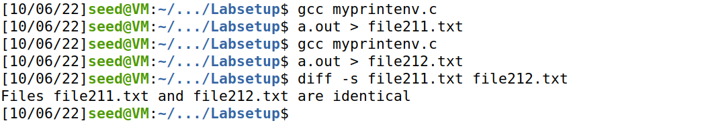
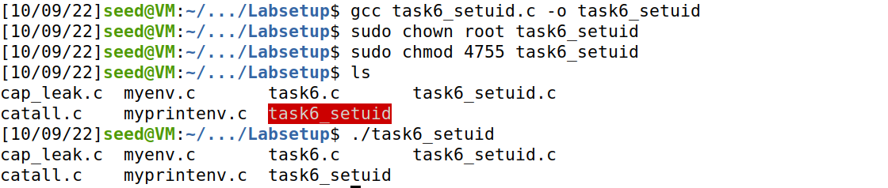

# Ficha SeedLabs

## Tarefa 1 
As execuções dos comandos **printenv** e **env** resultam no mesmo output, no entanto, com **printenv** é mais prático retornar uma variável de ambiente específica.
Os comandos **export** e **unset** são usados para alterar essas variáveis, sendo o **export** usado para editar e **unset** para "apagar" o conteúdo da variável.

## Tarefa 2
No primeiro passo deste exercício, após compilar e correr o ficheiro **myprintenv.c** obtemos, no ficheiro **file211.txt**, uma lista com as variáveis de ambiente do processo filho. 
No passo seguinte, fizemos a mesma coisa mas para o processo pai e o output foi escrito no ficheiro **file212.txt**.
Finalmente, ao comparar os dois ficheiros com o comando **diff**, conseguimos concluir que as variáveis de ambiente do processo filho são as mesmas que as do processo pai.

## Tarefa 3
A função **execve** executa um dado comando, recebendo o comando em si, um array de argumentos acabado em NULL e um array de variáveis de ambiente também acabado em NULL.
A constante **environ** é um array de pointers de strings que representam as variáveis de ambiente, sem este argumento(ou outro semelhante) na chamada à função **execve** com o comando **/usr/bin/env**, o terminal não retorna nada.

## Tarefa 4
Após executar o ficheiro **ex41.c**, verificamos que as variáveis de ambiente do processo atual são passadas para **/bin/sh**.
O output pode ser encontrado no ficheiro de texto **file41.txt**.

## Tarefa 5
Inicialmente mudamos o proprietário do ficheiro para **root** e alteramos as permissões para 4755, ou seja, 4 para ativar o **Set_UID**, 7 para permitir ao **owner** ler, escrever e executar o ficheiro foo e 55 para permitir ao **group** e **others** ler e executar.
Deste modo, ao executar o programa foo, este não lista algumas variáveis de ambiente que outrora mostrava, tais como a variável que alteramos: **LD_LIBRARY_PATH**. De resto, as variáveis **PATH** e **ANY_NAME** aparecem de acordo com as nossas modificações.

## Tarefa 6
Como é possível verificar na figura abaixo, ao correr o ficheiro **task6.c** executamos o comando **ls**.

Ao editar a variável de ambiente **PATH** com o comando apresentado abaixo, conseguimos que o **system** execute o código malicioso que se encontra no ficheiro **task6_malicious.c** em vez do comando **ls**.

Tal como explicado no enunciado, com a **dash shell** não é possível que um programa com privilégios **Set-UID** seja usado para um exploit já que esta previne essa situação desabilitando tais permissões. Para que esse exploit fosse possível, é necessário usar outra shell.

# CTF

Em primeiro lugar, analisamos o software usado, as suas respetivas versões e pesquisamos sobre estas na lista de CVEs. 

Apenas encontramos informação relevante sobre o plugin **Booster for WooCommerce** na CVE 2021-34646 (https://cve.mitre.org/cgi-bin/cvename.cgi?name=CVE-2021-34646), onde este plugin permitia o login de qualquer usuário incluindo o administrador saltando o passo de verificação de email depois de redenifir a password.

De seguida, consultamos a base de dados de exploits e encontramos o ficheiro que realiza este ataque. Ao executá-lo o programa retornou as hashs que permitiam aceder à conta de administrador.

Por fim, entramos na conta do administrador e através do link que nos foi dado no moodle (http://ctf-fsi.fe.up.pt:5001/wp-admin/edit.php) obtivemos acesso à flag pedida.

