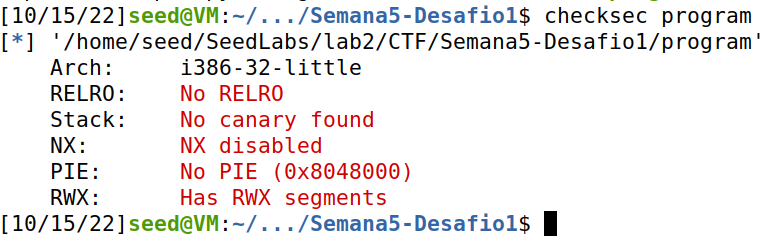

# Ficha SeedLabs

Antes de iniciar as tarefas desta ficha é necessário desativar a escolha aleatória de endereços
e utilizar uma shell com permissões diferentes (zsh).

## Tarefa 1

Após correr as duas versões do programa (a32.out e a64.out), observamos que ambas criam uma nova shell dentro da shell existente. Conseguimos ver que o resultado é o mesmo através da utilização do comando env como pode ser observado na figura abaixo.

## Tarefa 2

Tal como é referido no enunciado, na função bof é possível a ocorrência de buffer overflow já que o BUF_SIZE tem o valor de 100 mas a str de onde é copiado o conteúdo pode ter tamanho de 517. 
Isto acontece porque a função strcpy não verifica os tamanhos dos argumentos e também, pelo facto do conteúdo de str obtido no ficheiro badfile poderá ter conteúdo malicioso.

## Tarefa 3

### Investigation

O primeiro passo é criar um ficheiro vazio denominado badfile (primeira linha da imagem abaixo). 
A seguir, abrimos o debugger gdb, colocamos um breakpoint na função bof (comando destacado na imagem), corremos o programa e executamos a instrução "next" de modo a nos localizar-mos na chamada à função vulnerável strcpy.  

De seguida, através dos comandos dados no enunciado, obtemos o valor do registo do ebp (do caller) e do buffer.

### Lauching Attacks

Para conseguirmos realizar o ataque, precisámos de alterar alguns os sequintes valores no ficheiro exploit.py:
- **start:** como o tamanho de input máximo para a variável str é 517 e o tamanho do shellcode é obtido pela expressão len(shellcode), reservámos espaço o mais próximo possível do final do payload.
- **ret:** como o endereço do ebp é igual a 0xffffca78 e dado o que nos foi dito no enunciado, adicionámos um valor arbitrário, neste caso 500.
- **offset:** calculamos a diferença entre o endereço do buffer(0xffffca0c) e o frame pointer(0xffffca78). Para chegar ao return address pretendido adicionamos 4 a esse valor, obtendo 112.

Finalmente, ao correr o ficheiro, conseguimos criar uma root shell dentro da shell já existente.

# CTF

## Desafio 1

Como foi dito no enunciado, o comando **checksec** indica-nos, em contexto de proteções, que o programa:
- Não possui canary a proteger o return address (Stack)
- Permite execução da stack (NX)
- Não randomiza posições do binário (PIE)
- Possui regiões de memória com permissões de leitura e execução (RMX) 

Também podemos observar pelo código fonte que o ficheiro **mem.txt** é aberto. Este ficheiro está sob o nosso controlo, uma vez que, não é criado pelo **main.c**. Como é lido input de 28 chars guardados num buffer com espaço de 20 chars **podemos aproveitar-nos de um buffer-overflow** do mesmo.

Deste modo, dado o input de 20 caracteres aleatórios(neste caso 'p'), ao digitar o nome do ficheiro objetivo **flag.txt**,  conseguimos modificar a variável guardado em **meme_file** substituindo **mem.txt**.
Por fim descobrimos a flag deste desafio.

## Desafio 2

Neste desafio, como podemos ver as configurações dadas pelo **chekcsec** do programa são iguais.

Apesar disso, o código fonte age de modo diferente, verificando desta vez por um valor específico (**val**) logo a seguir ao **buffer-overflow** e também lê mais input (**32 chars**). 

Mesmo assim há possibilidade de executar o mesmo ataque ao mandar o valor **val** (o qual temos acesso no código fonte) em conjunto com o **flag.txt**.

Desta vez utilizamos o ficheiro **exploit-example.py** de modo a enviar para o input do programa o valor necessário na configuração correta.

Finalmente, depois da execução do ficheiro em python, chegamos à flag pretendida.

