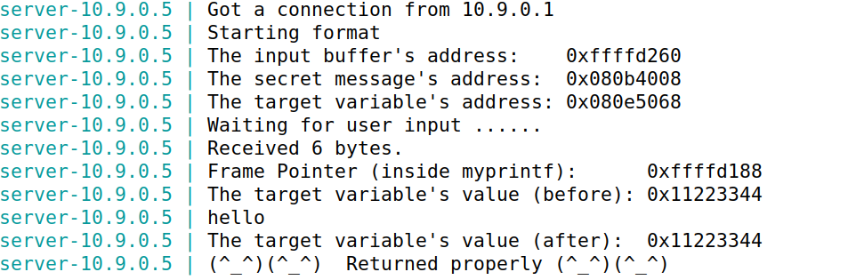

# Ficha Seed-Labs

## Set-Up

Primeiramente, tal como o guião nos indica, desativamos a escolha aleatória de endereços, uma vez que, nesta ficha teremos de adivinhar os mesmos.

De seguida compilamos o programa vulnerável que, a partir da chamada a **myprintf()**, vai-nos permitir realizar o ataque pretendido. Até na própria compilação o "gcc" lança um "warning" para alertar a presença desta vulnerabilidade.

Por fim, corremos o docker que inicializa os servidores deste lab e verificamos que podemos ter acesso a permissões **root** de qualquer um destes, já que temos acesso aos ids respetivos.

## Tarefa 1

Inicialmente, enviamos a mensagem "hello" para o server a correr no 10.9.0.5 através do seguinte comando: **echo hello | nc 10.9.0.5 9090**. Verificámos o output pretendido, uma mensagem de sucesso, tal como é possível verificar na imagem abaixo.

O objetivo desta tarefa é apenas crashar o programa a partir da introdução de um input de tamanho 1500 bytes(máximo aceite).
Para isso, e com o auxílio do ficheiro **build_string.py**, criamos um ficheiro que possui uma string preenchida com "%.8x".
Como é possível verificar na imagem abaixo, o output já não é bem sucedido como anteriormente.

## Tarefa 2

O objetivo desta tarefa é imprimir dados que se encontram em memória. Primeiramente, na tarefa 2.a, de dados que se encontram na stack e depois, na tarefa 2b, de uma mensagem que se encontra na heap, num endereço já conhecido.

### Tarefa 2A: Stack

Para este passo, criámos um ficheiro task2a.py onde, de forma semelhante à task1, criamos um ficheiro (task2a_badfile) onde colocamos uma string que começa com o valor 0xAABBCCDD e é seguida de um certo número n de "%x".

O número n, desconhecido, é o valor do offset entre a chamada da função printf e o nosso input.
 Descobrimos que n vai ser igual a **64**, já que é essa a distância que nos permite obter o valor 0xAABBCCDD no final output (assinalado na imagem abaixo). Todos os outros valores representam os dados presentes no offset da stack referido anteriormente.

### Tarefa 2B: Heap

Tal como na tarefa 2a, foi criado um ficheiro task2b.py que origina task2b_badfile com uma string que, na primeira posição, possui o endereço **0x080b4008** (**1º**), de seguida, 63 "%x" (**2º**) e no final um "%s" (**3º**).

- **1º**: endereço obtido no output com o identificador "The secret message's address" que pretendemos aceder de modo a ler a mensagem secreta
- **2º**: valor de n da alínea anterior menos um para que o último elemento da string seja %s
- **3º**: permite-nos ler o valor inicial da string e aceder ao endereço, obtendo assim a mensagem pretendida

Ao passar este ficheiro, obtemos a mensagem secreta apresentada abaixo.

## Tarefa 3

Nesta tarefa, o nosso objeto é alterar o valor **target**, primeiro, por um valor qualquer, e depois, por um valor específico.

### Tarefa 3A: Change the value to a different value

No output to server, é-nos dado o valor target inicial (0x11223344) e o endereço onde esta valor se encontra (0x080e5068).
 De forma semelhante à tarefa 2, criamos um ficheiro (task3a_badfile) com uma string com a seguinte estrutura: 
 - endereço do valor tardet (referido anteriormente)
 - 63 "%x", para dar print dos valores no offset entre a chamada da função printf e a nossa string
 - "%n", para trocar o valor do target para o número de carateres previamente impressos.

Finalmente, ao verificar o output, concluimos que o valor target foi alterado para 0xec (236 - nº de carateres impressos).

### Tarefa 3B: Change the value to 0x5000

Esta tarefa é bastante semelhante à anterior mas, em vez de um valor qualquer, temos de alterar o target para 0x5000.
 A estratégia utilizada é parecida à anterior, já que utilizámos "%n" para introduzir o valor pretendido. O valor 0x5000 é equivalente a 20480 em decimal, ou seja, para que consigamos alterar o target para este valor, teremos de imprimir o mesmo número de carateres.
 Para isso, em vez de construir uma string com 63 "%x", como anteriormente, usámos 62 "%.325x" seguido de um "%.326x". Estes identificadores, dar print ao valor com zeros à esquerda de forma a ocupar 325 ou 326 carateres. Desta forma, damos print a 20480 carateres e atribuimos o mesmo ao target, usando "%n".

Finalmente, verificamos no output que o valor do target foi alterado para o número pretendido - 0x5000.

