# Ficha Seed-Labs

## Set-Up

Tal como guião nos indica, corremos os containers dados e obtemos uma shell no container MySQL (10.9.0.5), como pedido.

## Tarefa 1

Começámos por criar uma shell dentro do container MySQL e correr o comando *mysql -u root -pdees* de modo a conseguirmos interagir com a base de dados disponibilizada.<br>
Nesta task, o nosso único objetivo é ter acesso às informações da employee Alice que se encontram na tabela **credencial**. Para isso, apenas corremos os comandos fornecidos no guião:
- use sqllab_users; : Dá load à base de dados
- show tables; : Mostra as tabelas existentes(neste caso é só a tabela referida acima)
Finalmente, executámos a query [INSERT QUERY] e assim conseguimos dar print à informação da Alice.

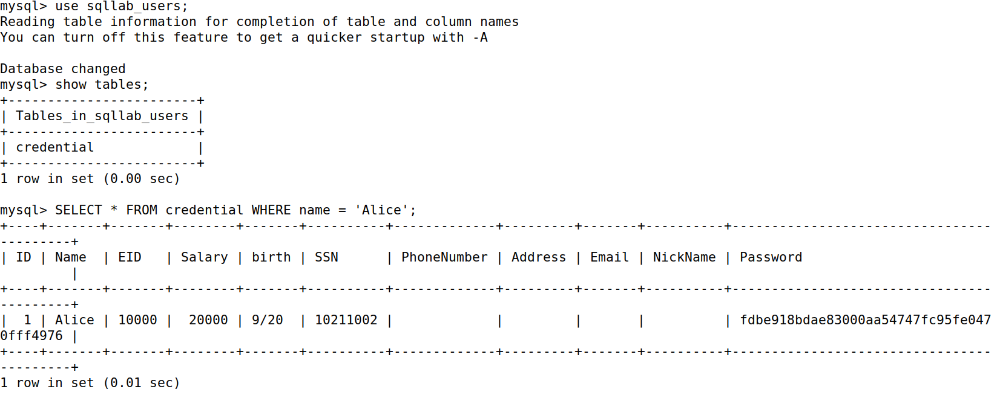

## Tarefa 2

O objetivo desta tarefa é fazer login como admintistrador.

### Tarefe 2.1: SQL Injection Attack from webpage

Primeiro, pretendemos fazer login na conta do admin, da qual não sabemos a palavra-passe.<br>

Para isso, analisámos o código que nos foi fornecido, que inclui a query apresentada abaixo, e percebemos que era possível descartar a verificação da palavra passe, não sendo também necessário preencher o seu campo.<br>

```sql
SELECT id, name, eid, salary, birth, ssn, address, email,
nickname, Password
FROM credential
WHERE name= ’$input_uname’ and Password=’$hashed_pwd’
```

Assim sendo, escolhemos o input **admin'#**. Aqui, a variável <ins>name</ins> tem o valor de admin, logo é possível entrar na condição que nos permite ver a informação pretendida. Depois, ainda no campo do username, colocamos uma plica para que, no código php, o campo *input name* seja dado por "terminado". Finalmente, acrescentamos um cardinal para que o resto da query seja comentada.

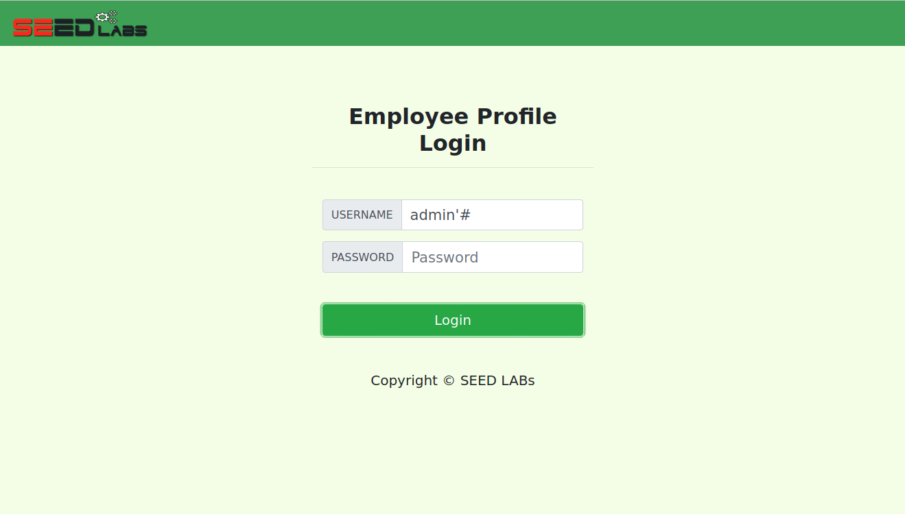

 Ao fazer login tivemos acesso à tabela com toda a informações dos *employees*.

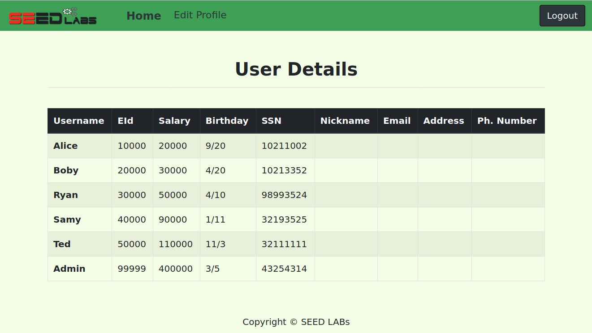

### Tarefa 2.2: SQL Injection Attack from command line

O objetivo desta tarefa é o mesmo da anterior mas, em vez de ser pela webpage, teremos de fazer login na conta admin pela linha de comando utilizando o comando **curl**.<br>

Como é possível ver na imagem abaixo, escolhemos o seguinte URL: <ins>www.seed-server.com/unsafe_home.php?username=admin%27%23&Password='</ins>. O username é o mesmo utilizado na tarefa anterior mas com a plica substituída por %27 e o cardinal substituído por %23. Mesmo assim, ambos os imputs são equivalentes.

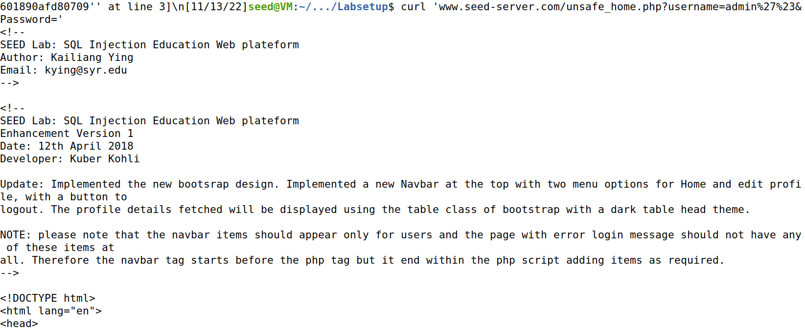

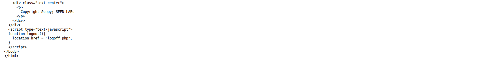

### Tarefa 2.3: Append a new SQL statement

Para correr mais que um comando SQL teríamos de separar as queries com um ;. Inicialmente, pensamos em utilizar o seguinte login com os seguintes elementos: 
- admin'
- query (terminada com ;)
- \# (para comentar a verificação da password)

Isto não foi possível nesta tarefa já que a query() não permite múltiplas queries.

## Tarefa 3

O objetivo desta tarefa é fazer updates na base de dados através da página de editar o perfil. desta vez, fizemos login como Alice usando o user name **alice'#**.

### Tarefa 3.1: Modify your own salary

Nesta tarefa, pretendemos aumentar o salário da Alice para uma quantidade escolhida por nós(100000). Para isso, no campo *NickName* (escolhido por ser o primeiro), introduzimos o seguinte input: <ins>',Salary='100000</ins>.

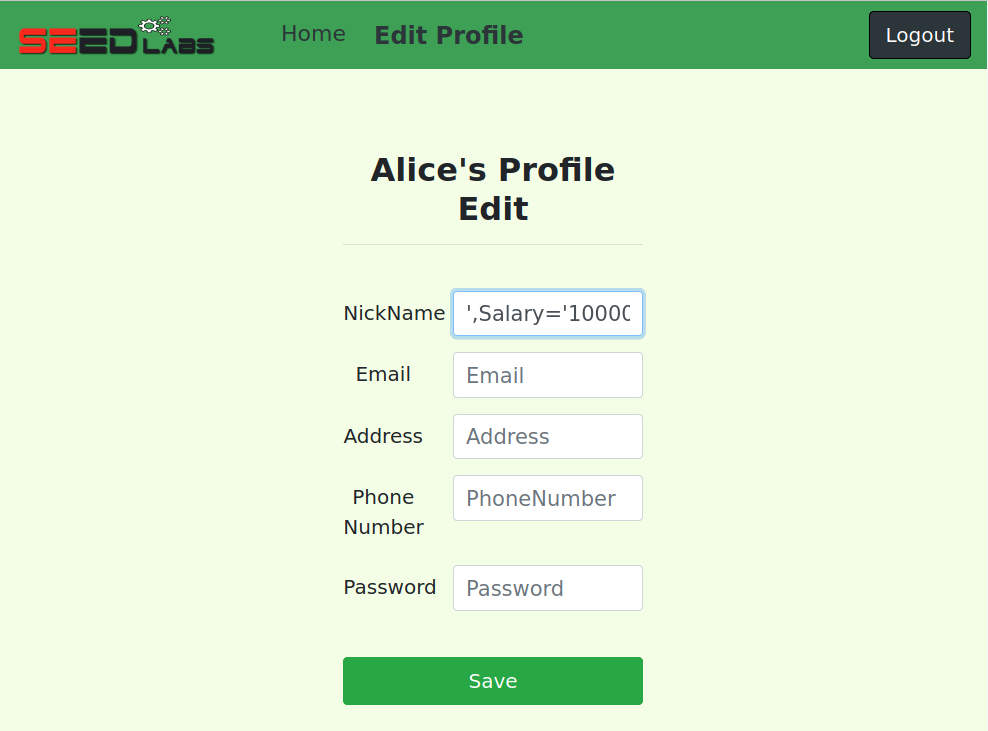

De uma forma semelhante ao que introduzimos na tarefa anterior, colocamos uma plica no começo para que o campo Nickname continue vazio. De seguida, colocamos uma vírgula e o campo Salary pretendido com uma plica antes do valor. Não adicionamos uma plica no final porque está será "fechada" no código fornecido.<br>

Assim, e tal como é possível observar na imagem abaixo, alterámos o salário da alice.

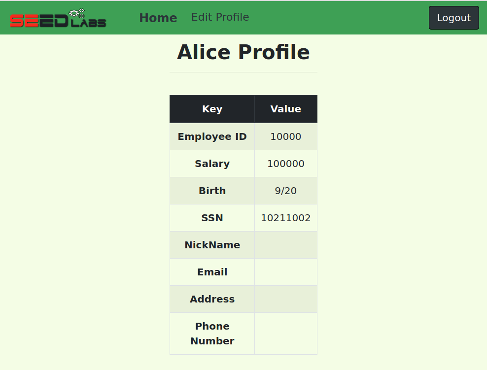

### Tarefa 3.2: Modify other peoples’ salary

Nesta tarefa pretendemos diminuir o salário do Boby para 1. Para isso, e ainda página de edit, na conta da Alice, introduzimos no campo do *Nickname* o input <ins>',Salary='1</ins> e no campo *Phone number* (último campo a ser verificado no código apresentado) o input <ins>'WHERE Name='Boby'#</ins>.<br>

O primeiro, que já foi explicado na tarefa anterior, permite alterar o Salary para 1. Já no segundo, especificamos a quem alterar esse campo, neste caso é ao Boby, e comentamos o resto da query apresentada no código (com o #). 

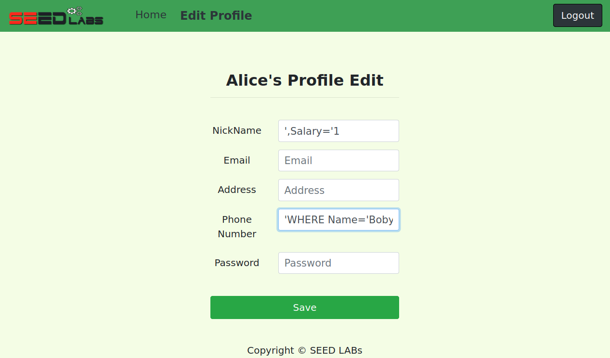

Deste modo, ao fazermos login como admin, conseguimos observar na tabela apresentada que o salário do boby se encontra a 1.

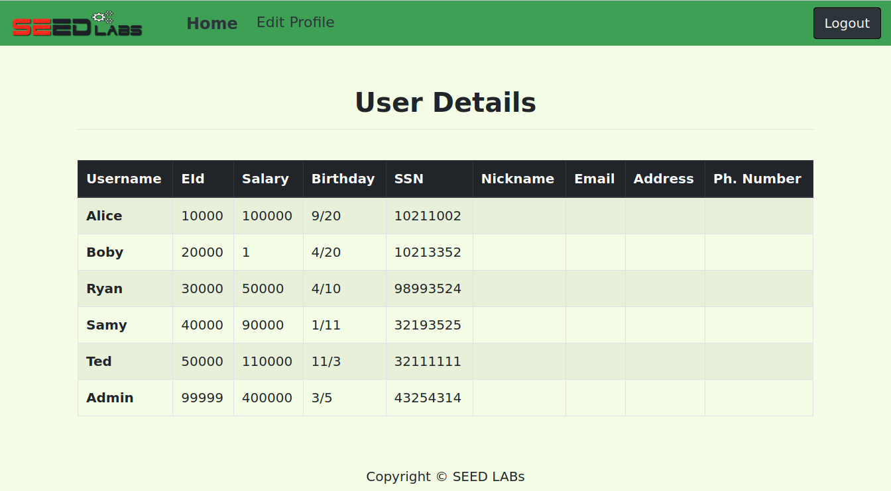

### Tarefa 3.3: Modify other peoples’ password

Nesta tarefa prentendemos alterar a palavra-passe do Boby para uma escolhida por nós - *password*. <br>
A partir do código que nos foi fornecido, mais especificamente na seguinte linha: **\$hashed_pwd = sha1(\$input_pwd);**, chegámos à conclusão que a alteração da palavra passe não poderia ser feito no campo *Password*, já que este campo é passado pela função sha1. <br>

Primeiro, obtemos o resultado da função sh1 aplicada à nossa palavra passe (**password**).

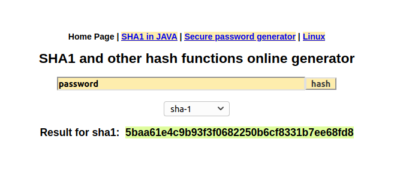

Depois, colocámos o input <ins>'Password="5baa61e4c9b93f3f0682250b6cf8331b7ee68fd8" WHERE name='Boby';#</ins> no campo *Nickname*.


Finalmente, entramos no perfil do Boby utilizando a nova palavra passe.


# CTF

## Desafio 1

Neste desafio verificamos a partir do guião que o index.php não sanitiza input devidamente.
Logo inserimos o username como admin, acrescentamos uma plica para "fechar" o campo do username da query presente no "index.php" e comentamos o resto com "-- ".

A password é arbitrária, uma vez que a validação foi comentada anteriormente, no entanto é necessária visto que este campo é obrigatório.

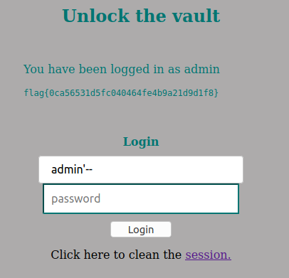

Deste modo conseguimos iniciar sessão como admin e obtemos a flag requerida!

## Desafio 2

Começamos por verificar as medidas de segurança do ficheiro e observamos que apenas possui PIE ativo, ou seja, teremos alocação de memória aleatória cada vez que o programa seja executado.

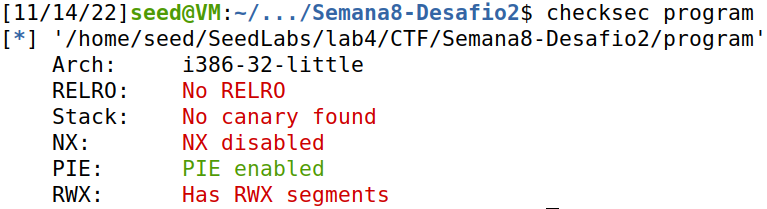

De seguida, ao olhar para o ficheiro **main.c** identificamos uma vulnerabilidade na chamada à função **gets**, visto que não possui qualquer sanitização de input.

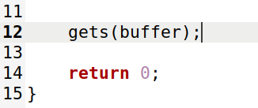

Apesar do PIE estar ativo, ao executar o ficheiro **program** verificamos que este imprime o endereço do buffer que é alterado. Sabemos também que a partir de um programa em python, temos possibilidade de recolher este endereço na altura de execução, assim iremos aproveitar-nos destas condições provocando buffer overflow, semelhante ao que fizemos na tarefa 3 do guião de seedlabs do logbook5.

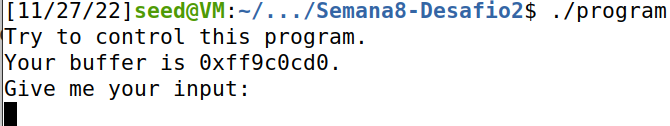

Para dar uso deste exploit descobriremos também o offset entre o início do buffer e o return address que queremos dar overwrite. Usando o debugger podemos encontrá-lo.
Começamos por criar um breakpoint na main, corremos o programa com **run** e executamos **next** para nos encontrar-mos dentro da própria main. Aí analisamos os primeiros 120 bytes a seguir ao endereço do buffer.

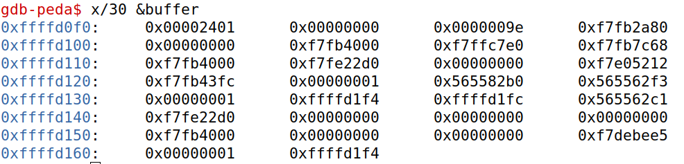

Sabemos que o return address da main e o registo ebp da frame anterior se posicionam logo a seguir ao campo das variáveis da main. Como podemos ver temos 100 bytes dedicados ao buffer, de seguida 4 bytes de padding, o registo ebp que, visto que nos localizamos na main, não estará definido, ou seja é 0, e por fim chegamos ao return address que procuramos. Deste modo calculamos o offset, sendo este 100 + 4 + 4 = 108.

Criamos então um ficheiro exploit_example.py no qual formamos o array de bytes **content** a ser inserido como input para o desafio.
Este array **content** será inicializado com 200 NOP's (0x90) de modo a preencher o buffer e ter espaço para um novo return address e código que nos permite aceder à shell, este shellcode será inserido no fim da stack, em endereços mais altos. Para o valor de retorno guardamos o valor do endereço que indica o início do shellcode na posição do offset.

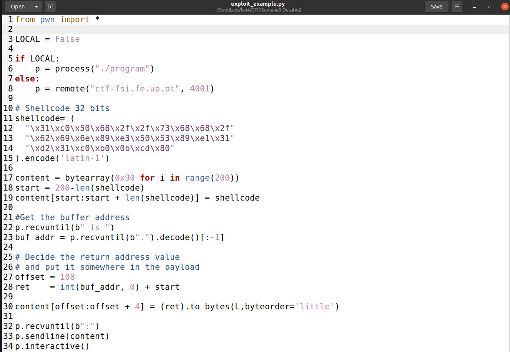

Ao executar o programa exploit_example conseguimos iniciar a shell com sucesso e assim aceder à flag.

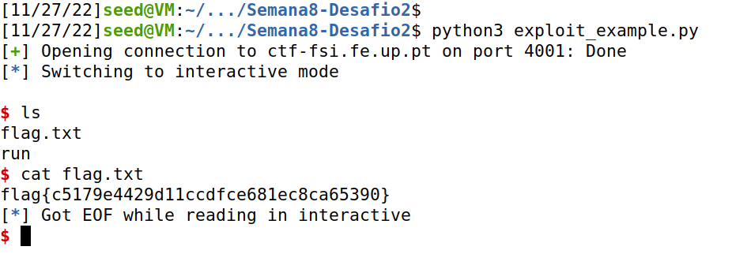
