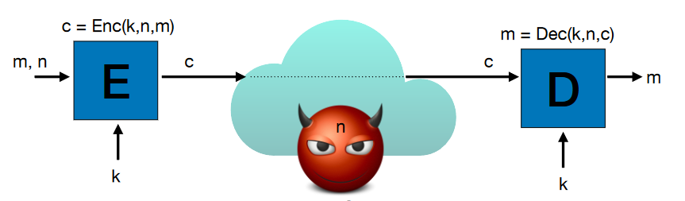
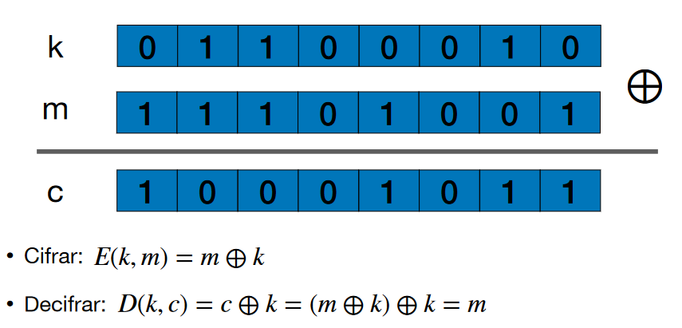
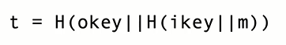
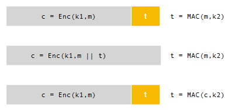
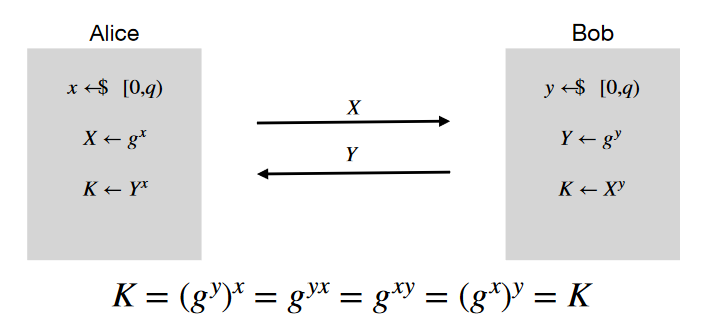
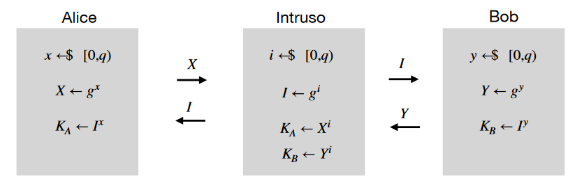
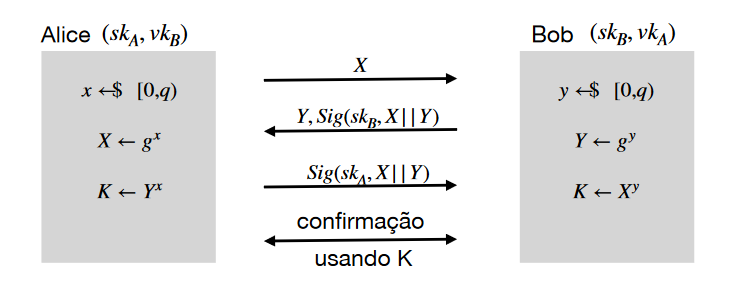

# FSI - Criptografia

---

# Segurança da Informação

Segurança da informação em:
- trânsito: A=>B, on-line - comunicação bidirecional (ex:HTTPS)
- trânsito: A=>B, off-line (ex:email, whatsapp)
- repouso: A=>A, ex. disk encryption

Propriedades:
- **Confidencialidade**
  - A informação está apenas disponível para o emissor e o recetor
  - cifras simétricas e assimétricas, acordos de chave
- **Autenticidade e Integridade**
  - Recetor tem a certeza que os dados que recebe vem de um emissor específico e sem alterações
  - assinaturas, acordos de chave, MAC
- **Não-repúdio:**
  - assinaturas digitais
  - após enviar uma menagem assinada, o emissor não pode mais tarde negar que a assinou

# Cifras Simétricas

Cifra: primitiva que dá confidencialidade
Simétrica: usamos a mesma chave dos dois lados(emissor e recetor)

Do lado do emissor:
- algoritmo de cifração com 3 parametros:
  - k: chave secreta que é igual dos dois lados
  - n: nonce (no more than once), para reutilizar as chaves esta parametro vai ter de ser mudado. Parametro público
  - m: mensagem a transferir
- retorna mensagem cifrada - c

Do lado do recetor:
- Algoritmo que inverte a transformação
  - k: mesma chave
  - n: mesmo nonce
  - c: dados que queremos decifrar
- retorna mensagem decifrada(original) - m  

Estes algoritmos são públicos e usam chaves de 128 bits - nº de chaves possíveis é de 2^128 sendo que o poder computacional total da humanidade fica abaixo de 2^80

## Casos de Uso

- **One-time key**
  - nonce não é relevante porque a chave não é reutilizada - pode ser 0
  - ex: email
  
- **Many-time key**
  - nonce não se pode repetir - valor de sequência ou valor aleatório
  - ex: cifrar disco, https

## One-Time-Pad

Cifração com base na operação XOR. 

- m: mensagem 
- k: um valor aleatório com o mesmo número de bits que a mensagem a cifrar.

Não é utilizada na prática porque a chave tem de ser do tamanho do texto limpo (que pode ser muito grande) e é apenas utilizada uma vez.

## Cifras Sequencias

Solução para o tamanho da chave/texto limpo:
- **Gerador Pseudo-Aleatório(PRG)**: dada uma chave pequena(128 bits), cria uma string do tamanho do texto limpo. Recebe uma chave secreta.

Solução para a chave ser usada apenas uma vez:
- PRG que para além da chave privada recebe também o nonce público

## Cifras de Bloco

Não são cifras, permitem construir cifras. 
Dado um bloco de 128 bits e uma chave também com 128 bits, produz outro bloco do mesmo tamanho.

É acreditado que dada uma chave aleatória e secreta e um input 16 bytes,
quando o emissor calcula o output correspondente, este resultado irá parecer aleatório, mesmo o algoritmo sendo público.

**AES**: Advanced Encryption Standard

**Electronic Code Book**: Inseguro, usada sempre a mesma chave, logo, se tiver blocos do ficheiro iguais, os blocos do criptograma vão ser também iguais.

**Cipher Block Chaining Mode**: Seguro, para além da chave recebe no input um Initialization vector(IV)público que é aleatório e altera a todos os blocos.

**Counter Mode**: Seguro, mais usado,cifra sequencial com o nonce que inclui um contador

# Poder do adversário

- Bit flip: Trocar um bit na mensagem cifrada entre o emissor e o recetor
- A confidencialidade não abrange este problema

Para isso é necessário:
- Integridade: a mensagem não é alterada
- Autenticidade: recetor e emissor partilham uma chave secreta e o recetor apenas aceita mensagens transmitidas pelo emissor

(autenticidade => integridade)

---

# Message Authentication Codes (MAC)

Algoritmo público e standard.

Noutros métodos é utilizado um checksum criptográfico, que pretende garantir a integridade das mensagens contra erros. Não é totalmente seguro pois o atacante pode alterar o crc e a mensagem para que estes correspondam.

O MAC é um checksum que para ser calculado é preciso saber uma chave(128 bits).

A mensagem (pública) é enviada com uma tag (normalmente 256 bits) que foi calculada no emissor e será confirmada no recetor a partir do algoritmo MAC.

Ataques possíveis:
- Remoção de mensagens
- Duplicação de mensagens
- Reordenação de mensagens

Soluções:
- Garantir que o emissor transmite a mensagem apenas uma vez
- Juntar à mensagem um número de sequência - permite verificar a ordem das mensagens, a remoção e a duplicação.

## Contruções MAC: HMAC

função de hash criptográfica: receb um input de qualquer tamanho e retorna um output de tamanho fixo. 

**SHA-256**: output de 32 bytes - 256 bits

- ikey: input key
- H(ikey||m): calcular um hash da mensagem - 32 bytes
- okey: outout key
- H(okey||H(ikey||m)): aplicar o algoritmo novamente com a okey, criando a tag (t)

## Contruções MAC: Poly1305

Blocos da mensagem são usados como coeficientes de um polinómio com a variável r - valor aleatório.

Pode ser usada apenas uma vez.

---

# Confidencialidade e Autenticidade

- cifra(confidencialidade) + MAC(autenticidade)
- duas chaves secretas

Três hipóteses:
- Encrypt and MAC (SSH) - cifra e MAC em paralelo
- MAC Then Encrypt (SSL) - 1º obter a tag com MAC (k2), 2º concatenar essa tag com a mensagem, 3º aplicar a cifra à mensagem (k1)
- Encrypt Then MAC (IPSEC) - 1º cifrar a mensagem (k1), 2ºautenticar o criptograma recebido (MAC com k2) -> mais usada

--- 

# AEAD - Authenticated Encryption with Associated Data

Abstração que engloba a cifra e o MAC para implementar um canal seguro com criptografia simétrica.

Garante a confidencialidade da mensagem e a autenticidade do criptograma e dos metadados(endereços ip, nº de sequencia,...). Mais eficiente.

- Enc(n,k,m,data) => (c, t)
- Dec(n,k,c,t,data) => m, mas apenas se (c , data) autênticos

---

# Aleatoriedade

Na teoria, Aleatoriedade perfeita:
- sequência de bits
- cada bit é independente dos outros
- a probabilidade de um bit ser 1 ou 0 é 50%

Na prática, gerar aleatoriedade é dificil.

Mecanismos usados:
- fontes de entropia: números puramente aleatórios, medição de processos físicos(temperatura, atividade do processador/utilizador, ...), muito pouco eficiente
- geradores pseudo-aleatórios: tem um estado que é periodicamente atualizado com as bit strings aleatórias que vem da entropy pool. Cria string não completamente aleatórias mas que o parecem.

---

# Limitações da criptografia simétrica

## Gestão de chaves

Para N agentes são necessárias N(N-1)/2 chaves. 
Difícil a distribuiçao de chaves(configuração manual?) ou a adição de mais um agente.

- **Sistemas fechados**:
  - sistema onde existe uma autoridade que conhece todos os agentes
  - para participar, é necessário partilhar uma chave com este servidor central
- Para dois agentes comunicarem:
    - usar o canal seguro entre A e o Key Distribution Center e o canal seguro entre o Key Distribution Center e o B para transmitir uma chave de um lado para o outro

## Chaves de Sessão

Chaves de longa duração: 
- partilhadas quando uma pessoa se regista num sistema
- tem de ser guardadas de forma muito cuidadosa

Chaves de sessão:
- podem estar em memória
- efémeras, os danos são limitados se forem comprometidas - forma de isolamento

---

# Cifras Assimétricas

## Cifras de chave pública

Utilizada para resolver o problema da partilha de chaves.

Cifra tem uma chave pública, para toda a gente, mesmo atacantes, e uma chave privada que permite decifrar a mensagem. Quem gera a chave pública, é o titular da chave secreta.

Muito mais ineficiente que cifras simétricas porque as chaves assimétricas tem um tamanho muito mais elevado(milhares de bits) e apenas conseguem cifrar mensagem curtas - chaves simétricas(dezenas de bytes).

Paradigma Híbrido:
- Utilizado nos emails cifrados
- Para enviar uma mensagem é gerada uma chave de sessão efémera. Esta chave vai ser cifrada com a chave pública do destinatário. Com a chave de sessão é cifrada a mensagem usando uma cifra simétrica. Estas duas coisas são transmitidas ao destinatário. Desta forma, o destinatário tem acesso à chave de sessão (decifra com a sua chave privada) e à mensagem (cifra simétrica com a chave de sessão).

---

# Assinaturas Digitais

Equivalente eletrónica às assinaturas manuscritas.

Chave de assinatura (privada) - permite ao emissor mandar uma mensagem autenticada - e chave de verificação (pública) - permite ao recetor verificar a autenticação.

Pressupostos:
- chave de assinatura apenas pertence a uma entidade e que não foi comprometida
- algoritmos de assinatura corretos e seguros
- correspondência entre chave de verificação e chave de assinatura

Garantem **autenticidade** e **integridade**, tal como os Message Authentication Codes simétricos. 
No entanto, não garantem a propriedade de não reúdio porque a chave pode ser conhecida por várias pessoas.

## Assinaturas com base em RSA

Mais popular, ainda predominante em aplicações de assinatura eletrónica. Algoritmos muito lentos e ineficientes comparado com a solução seguinte.

## Assinaturas com base em curvas elípticas (ECDSA)

Chaves púbicas mais curtas e algoritmos mais rápidos. Utilizada em aplicações de autenticação online (whatsapp,...).

## Envelope digital

Utilização conjunta de cifras assimétricas e assinaturas digitais.

Benéfico autenticar o criptograma. 
Para garantir não repúdio:
- assinar o documento original e só depois cifrar (senão a pessoa que assinou pode negar saber o conteúdo do criptograma)

---

# Cenário Email Seguro

Pressupostos:
- emissor conhece a chave pública do recetor - cifra assimétrica
- recetor conhece a chave pública de verificação do emissor

Objetivos:
- mensagem a enviar deve ser confidencial
- mensagem deve ser autêntica e não-repudiável - garantir que a mensagem veio do emissor e que este não pode alegar que não conhecia a mensagem

O que não é garantido:
- o emissor ter a certeza que o recetor recebeu e aveitou a mensagem

## Sign-then-Encrypt

Emissor assina a mensagem e cifra-a com a chave pública do recetor.

Para que o recetor consiga provar que vou o emissor a enviar a mensagem. As mensagens que o emissor envia devem ter o destinatário final.

# Cenário Acordo de Chaves

Parte do princípio que existe a possibilidade de partilhar chaves públicas autênticas.

Alguns acordos de chaves usam cifras assimétricas e outros usam assinaturas(mais usado).

Objetivos:
- estabelecer uma chave confidencial, autêntica e confirmada. Ou seja, ninguém, para além do emissor e do recetor, conhece a chave; o emissor tem a certeza que o recetor conhece a chave e vice versa (conhece no sentido que já utilizou)
- **perfect forward secrecy**: garante que, se comprometer chaves de longa duração(de assinatura), as sessões anteriores não ficam comprometidas

Não tem como objetivo garantir o não repúdio de mensagens.

# Protocolo Diffie-Hellman

Não utiliza cifras de chave pública para transportar chaves simétricas.

Parâmetros públicos (G, g, º)

- Conjunto G: 
  - Inicialmente, eram valores inteiros em [0, p[, sendo p um número primo grande
  - Atualmente, pontos numa curva elíptica (razões de eficiência). Pares de números inteiros (coordenadas x e y).

- Operação º:
  - em caso de inteiros, esta operação é multiplicação seguida do módulo pelo primo.
  - nas curvas elípticas, esta operação utiliza 2 pontos da curva para obter um terceiro ponto também na curva

- Gerador g:
  - quando elevado a um expoente gera vários números no conjunto
  - idealmente, existe um número q(primo) que diz quandos valores diferentes é possível gerar

Propriedade: (g^x)^y = g^(xy) = g^(yx) = (g^y)^x

x e y minúsculos são os únicos parâmetros secretos.

O resultado K terá de ser passado por uma função de hash para obter a chave simétrica.

Uma das propriedades que estes parâmetros tem de ter é a unidirecionalidade da operação, ou seja, não deve ser possível andar para trás na exponenciação(logaritmo discreto).

Este protocolo é anónimo, ou seja, nada identifica o emissor e o recetor. Pode abrir caminho para um ataque Man-in-the-Middle.

## Ataque Man-in-the-Middle

Interceta a comunicação do emissor e recetor e altera as mensagens pelos seus próprios parâmetros. Ataque indetectável. Só se pode resolver se existirem chaves de longa duração para autenticar as comunicações.

Estes ataques são possíveis quando:
- são trocados parâmetros públicos na rede
- não sabemos a origem desses parâmetros

# Protocolo Diffie-Hellman Autenticado

Emissor tem uma chave de longa duração (skA) e do lado do recetor é conhecida a chave de verificação do emissor (vkA) e vice-versa.

As mensagens trocadas levam mais uma componente de autenticação. São enviadas assinaturas calculada com a chave de assinatura e com o par X e Y (Sig(sk,X||Y)).

# Estabelecimento de Canais Seguros

- Autenticação das chaves públicas (permitem fazer verificação de assinaturas)
- Protocolo de acordo de chaves
  - garante a autenticidade das chaves simétricas através da mesma propriedade de chaves públicas
- Desenhar este protocolos é muito difícil: forma de garantir que um conjunto de componentes seguros é também seguro
