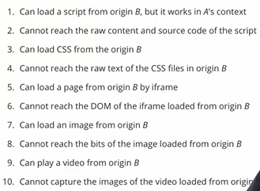

# FSI - Segurança Web

---

# Protocolo HTTP

Recursos são identificados por uma localização uniforma (**URL**) dividido em 4 partes: 
- esquema (http, https, ...) - como vamos aceder ao recurso
- domínio (aaa.bbb.ccc) - identificador associado a uma máquina, potencialmente uma porta específica
- caminho para o recurso dentro dessa máquina (path)
- informação extra (ex: queries)

Operações que podem ser feitas sobre os recursos:
- get (obter um recurso)
- post (criar um novo recurso)
- put (substituir uma coisa que já existe)
- patch (alterar parte de um recurso que já existe)
- delete (apagar um recurso)

Mecanismo de **cookies**: servidor pede ao browser para armazenar informação que vai ser guardada num ficheiro no browser. Sempre que o browser volta a pedir um recurso ao mesmo servidor, devolve esse ficheiro.

---

# Modelo de execução

Eco-sistema cliente-servidor. Do lado do cliente podemos ter dispositivos diversos (pc, tablets,...), dentro dessas máquinas temos um browser, no meio temos a internet e do lado do servidor temos um sistema mais complexo. Este sistema possui tecnologias de armazenamento (ex. bases de dados) e de comunicação com os clientes.  
Existe computação em ambos os lados. Do lado do cliente, os browsers funcionam como pequenos sistemas de virtualização para garantir alguma segurança. 

Conteúdos de uma janela do browser:
- frame (tab)
- iFrame (subframes) - objetos flutuantes. Podem existir por razões funcionais, aproveitar proteção do browser sober este elemento para isolamento de frames. Este isolamento permite que a página mãe funcione mesmo que este elemento falhe.

---

# Modelos de Ataque

- **Atacante externo/rede**: Adversário controla apenas o meio de comunicação.
- **Atacante interno/web**: Adversário controla parte de aplicações web (servidor ou cliente malicioso)
    - Adversário controla servidor: impedir abuso da máquina cliente
    - Atacante que controla cliente: impedir abuso dos recursos no servidor

---

# Modelo de Segurança

Analogia SO / browser:
- Processos / Página 
- Ficheiros / Cookies
- Sockets, TCP / Fetch, HTTP
- Sub-processos / Frames, iFrames

## Same Origin Policy (SOP)

Modelo de isolamento. O browser vai tentar impedir, definindo o que é uma origem, que código a executar no contexto de uma origem possa ter acesso a recursos que foram carregados por outra origem. Garante-se assim, confidencialidade e integridade(não se consegue alterar recursos vindos de outra origem).  

No **DOM**, vai haver uma árvore que define todos os recursos, irão existir então subarvores correspondentes a subframes. A cada frame o browser vai fazer corresponder uma origem, que corresponde ao sítio de onde vieram os recursos que estão a executar naquele contexto. 
Esta origem inclui o esquema, o nome do domínio completo e a porta.

### Pedidos ao servidor 

Uma página pode conter recursos de várias origens. Escrita é geralmente permitida. As comunicações com o servidor tem poucas restrições. Há restrições referentes a como, programaticamente, posso mexer em recursos que vêm de outras origens.  
Dados contidos na resposta do servido podem ser processados nativamente pelo browser mas não programaticamente.

## Cross-Origin Resource Sharing (CORS)

Mecanismo que permite aos serviços relaxar as políticas de SOP. Um servidor B pode autorizar o browser a permitir a uma página vinda de A aceder aos recursos que vem de B. Esta autorização é feita através do atributo <ins>Access-Control-Allow-Origin</ins>.

## SOP para cookies 

Diferente definição de origem, o que a cookie declara quando é criada: domínio e path, o esquema é opcional. 
Uma página pode definir cookies para o seu próprio domínio ou para domínios acima na hierarquia (write-up).

Formas de enviar cookies: 
1. **SameSite = None**: Tradicionalmente eram enviadas quando o domínio da cookie for um sufixo do URL e a path for um prefixo do URL. Ou seja, quando se fixa uma cookie, queremos que todos os recursos que estão abaixo na hierarquia possam beneficiar dessa cookie. 
2. **SameSite = Strict**: Reforça a propriedade de apenas enviar cookies quando o pedido tem a mesma origem que a top-level frame.
3. **SameSite = Lax**: Relaxa as restrições de cross domain

Garantir que as cookies estão tagged como **Secure cookies**, ou seja, são só enviadas por https, garantindo que ninguém as inspeciona na rede.

---

# Ataques

# Cross-Site Request Forgery

O servidor é o alvo. 

**Session Hijacking**: Site malicioso pede recurso noutro site, o atacante observa a cookie na rede.  

Se as cookies forem HTTPOnly, o javascript(mesmo que seja malicioso), não a pode inpecionar, no entanto o ataque anterior funcionaria na mesma. 
Pode-se pedir um recurso que causará efeitos secundários no servidor e, se estiver autenticado no site, a cookie de autenticação irá ser enviada com este pedido fazendo com que o servidor possa vir a aceitar.  

O atacante cria uma sessão em seu nome no site alvo. Passa assim a ter acesso ao histórico de pesquisas do utilizador.  

No modelo web, não é possível impedir pedidos que sejam feitos para outros servidores, incluindo os que poderão causar side-effects. Este problema não se limita a cookies (ex: routers).

## Mitigação

Criar tokens (strings aleatórias) em html que javascript não consegue ler que é enviado no POST. Javascript malicioso não conseguirá fazer POSTs já que não tem acesso ao token. 
Utilizar políticas de cookies mais restritas (SameSite = Strict). 

---

# Injeção de Comandos

Inserir input não validado, quando o programa é executado, obtemos um efeito indesejado (objetivo do atacante). 
Muitas aplicações web fazem chamadas à shell (*exec()*), portanto pode existir injeção de comandos. 

## SQL Injection

Muitas vezes, comandos de SQL(codificados como strings) incluem substrings controladas pelos utilizadores, podendo alterar assim a semântica do comando SQL.  
Exemplos:
- <ins>id OR 1 = 1</ins> -> sempre verdadeiro. Numa query select daria acesso a uma tabela ou várias tabelas
- username: <ins>"or""="</ins>  password: "or""="-> acesso a todos os utilizadores
- info; DROP TABLE Suppliers; -> consegue eliminar uma tabela inteira da base de dados
 
Por vezes, as bases de dados não tem desativada a funcionalidade de a partir de SQL correr comandos shell. Atacantes podem tirar partido desta vulnerabilidade usando *xp_cmdshell()*.

### Proteção

Não criar comandos SQL à mão, utilizar comandos parametrizados ou bibliotecas ORM.

**Comandos parametrizados**: placeholders(carater ?) para os parametros recebidos em runtime. É necessária a sanitização desses parâmetros. Tem também benefícios de performance (as queries já são previsíveis).

**Bibliotecas ORM**: oferecem abstrações (independentes de sql e do backend da bd) que permite inicializar uma ligação a uma base de dados onde a estrutura das classes reflete a estrutura das tabelas. Oferece mecanismos de sanitização de inputs.

---

# Cross Site Scripting (XSS)

O objetivo é executar código malicioso no cliente que provoca ações não desejáveis. 

O atacante consegue que um site no qual o cliente confia, envie código malicioso do browser para o cliente.  

**Reflected XSS**: o atacante faz um pedido malicioso a um site confiável e este leva o cliente logo a excutar um script malicioso. Esta variante acontece instantaneamente. 

**Stored XSS**: o atacante consegue depositar algo malicioso na base de dados de um servidor de uma aplicação. Mais tarde, outro utilizador vai, através da aplicação, recolher essa informação da base de dados, o que provocará a execução de código malicioso na sua máquina. Esta variante demora mais tempo.  

## Prevenção

Posteriormente, foram implementados **filtros** que eliminavam scripts de todo o código que era enviado para o cliente.   

**Content Security poolicy (CSP)**: conjunto de políticas (ao nivel do servidor) a definir quando se cria uma aplicação web que restringem que tipo de javascript pode ser executado nas máquinas clientes debaixo da origem (não executar javascript que se encontra perdido no meio de uma página).  